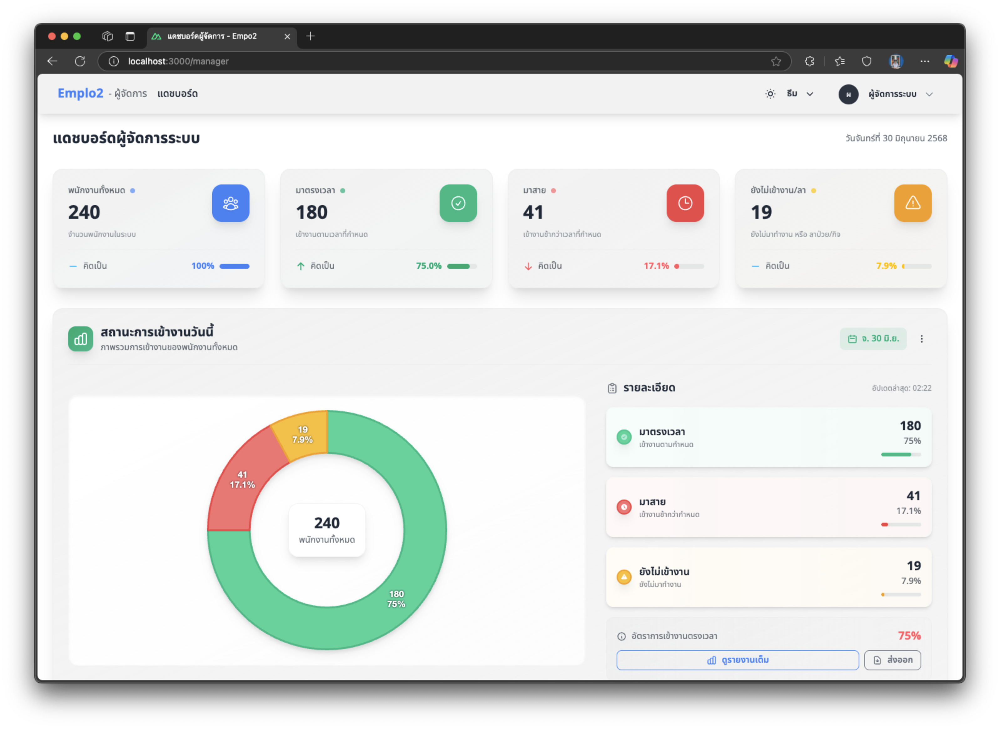
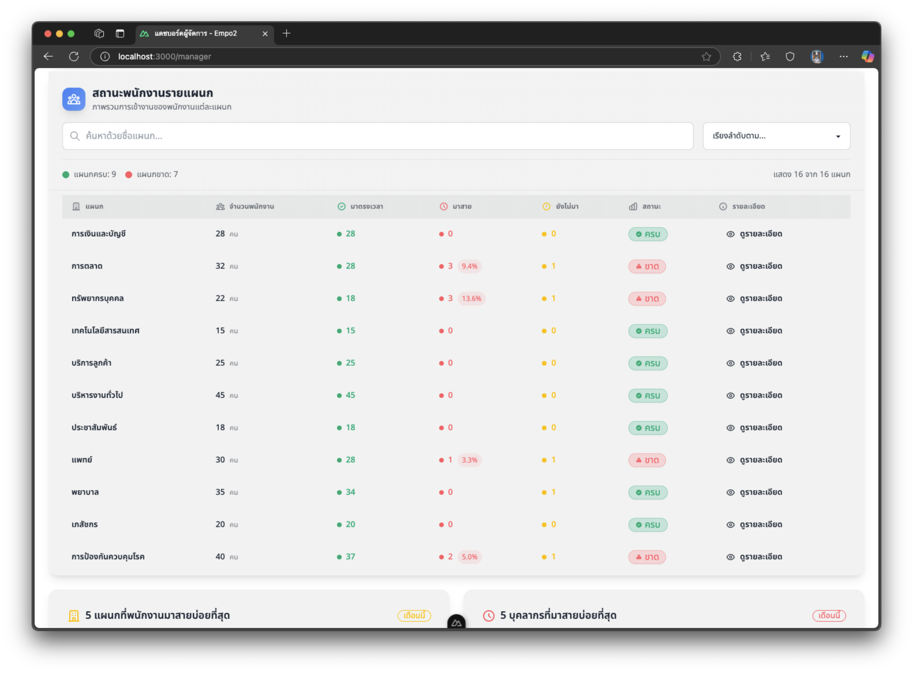
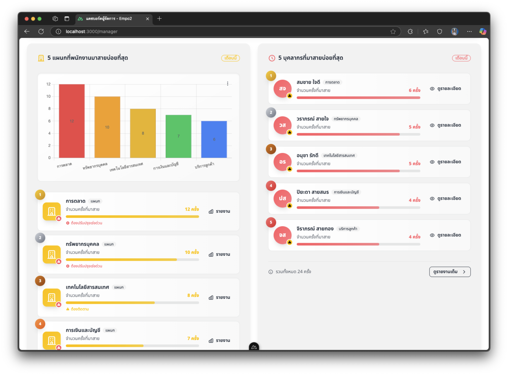
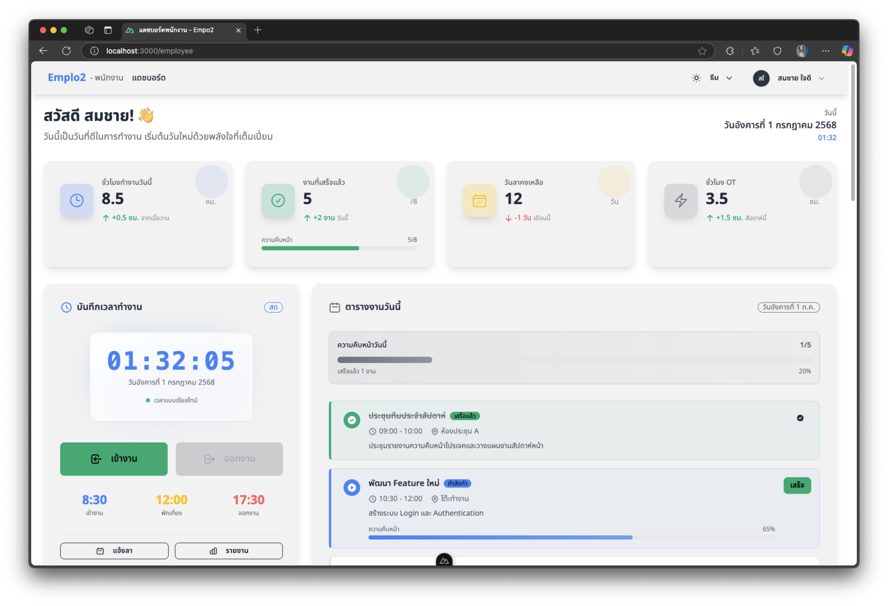
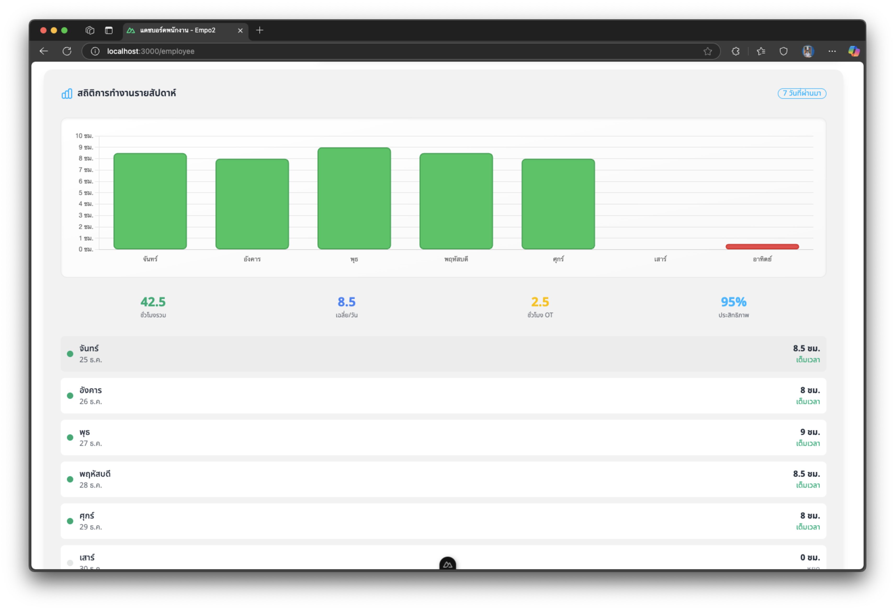
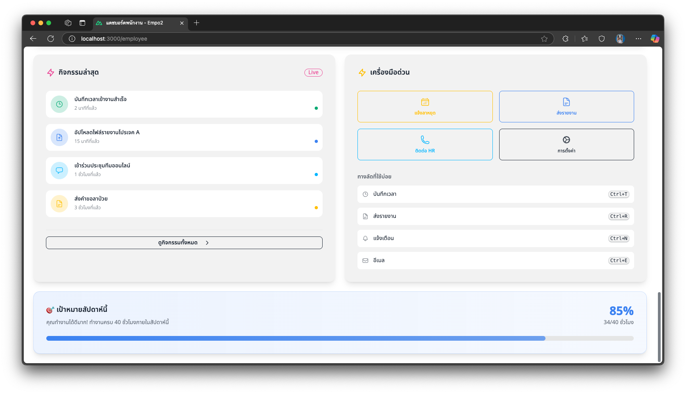

# ระบบจัดการพนักงาน (Employee Management System)

ระบบจัดการพนักงานที่พัฒนาด้วย Nuxt.js และ Tailwind CSS สำหรับการจัดการข้อมูลพนักงาน การตรวจสอบเวลาการทำงาน และรายงานสถิติ

## ภาพประกอบ
 
 
 
 
 
 


## คุณสมบัติหลัก

- **แดชบอร์ดผู้จัดการ**
  - ดูภาพรวมพนักงานทั้งหมด
  - ตรวจสอบสถิติการมาทำงาน
  - วิเคราะห์ข้อมูลการเข้าออกงาน

- **จัดการข้อมูลพนักงาน**
  - ดูรายชื่อพนักงานทั้งหมด
  - จัดการข้อมูลส่วนตัว
  - ตรวจสอบประวัติการทำงาน

- **ระบบบันทึกเวลา**
  - บันทึกเวลาการทำงาน
  - รายงานการมาสาย/ขาดงาน
  - อนุมัติการลางาน

## เทคโนโลยีที่ใช้

- **Frontend**: Nuxt.js 3, Vue 3, Tailwind CSS
- **State Management**: Pinia
- **Icons**: Heroicons
- **UI Components**: DaisyUI
- **Build Tool**: Vite


## วิธีติดตั้ง

1. คลอนโปรเจค
```bash
git clone [repo-url]
cd nx_empo2
```

2. ติดตั้ง dependencies
```bash
npm install
# หรือ
pnpm install
```

3. สร้างไฟล์ `.env` จาก `.env.example` และกำหนดค่าที่จำเป็น

4. รันโปรเจค
```bash
npm run dev
```

5. เปิดเบราว์เซอร์ที่ [http://localhost:3000](http://localhost:3000)

## สิ่งแวดล้อม

- Node.js 18+
- npm 8+ หรือ pnpm 7+

## โครงสร้างโปรเจค

```
src/
├── assets/         # ไฟล์ static
├── components/     # components ที่ใช้ร่วมกัน
│   └── managerDashboard/  # components สำหรับแดชบอร์ดผู้จัดการ
├── composables/    # composition API
├── layouts/        # layout หลัก
├── pages/          # หน้าเว็บ
│   ├── manager/    # หน้าสำหรับผู้จัดการ
│   └── employee/   # หน้าสำหรับพนักงาน
└── stores/         # Pinia stores
```

## การพัฒนา

รันโหมดพัฒนา:
```bash
npm run dev
```

สร้าง production build:
```bash
npm run build
```

## การทดสอบ

รัน unit tests:
```bash
npm run test
```

## ข้อกำหนดระบบ
npm run dev

# pnpm
pnpm dev

# yarn
yarn dev

# bun
bun run dev
```

## Production

Build the application for production:

```bash
# npm
npm run build

# pnpm
pnpm build

# yarn
yarn build

# bun
bun run build
```

Locally preview production build:

```bash
# npm
npm run preview

# pnpm
pnpm preview

# yarn
yarn preview

# bun
bun run preview
```

Check out the [deployment documentation](https://nuxt.com/docs/getting-started/deployment) for more information.
# emplo2
